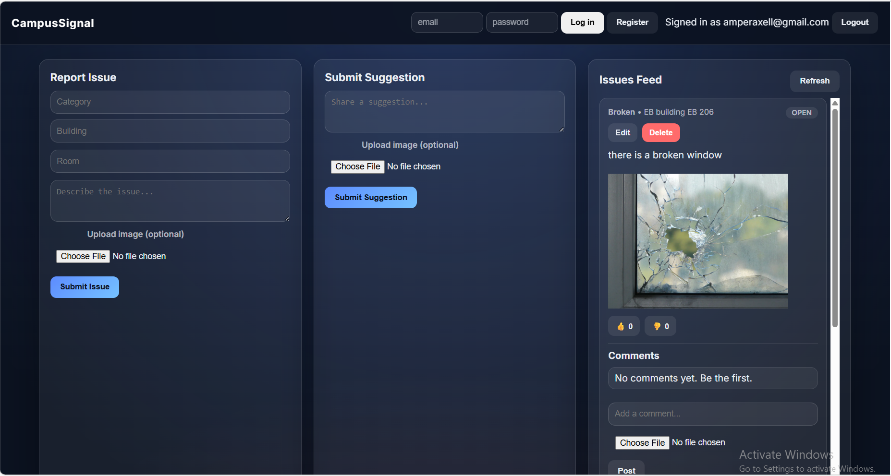
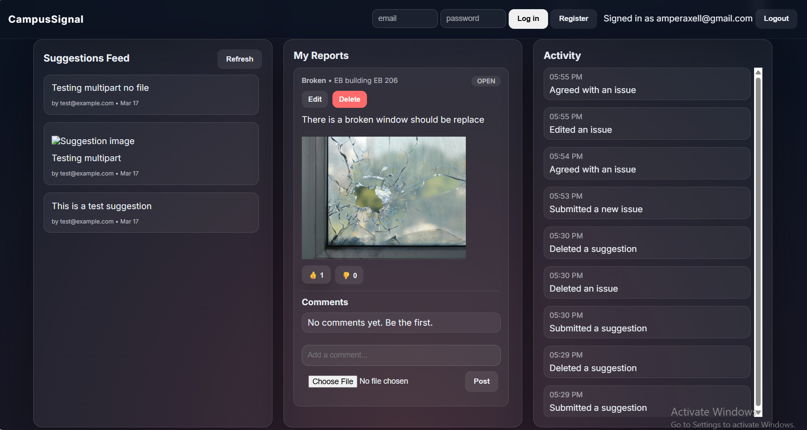
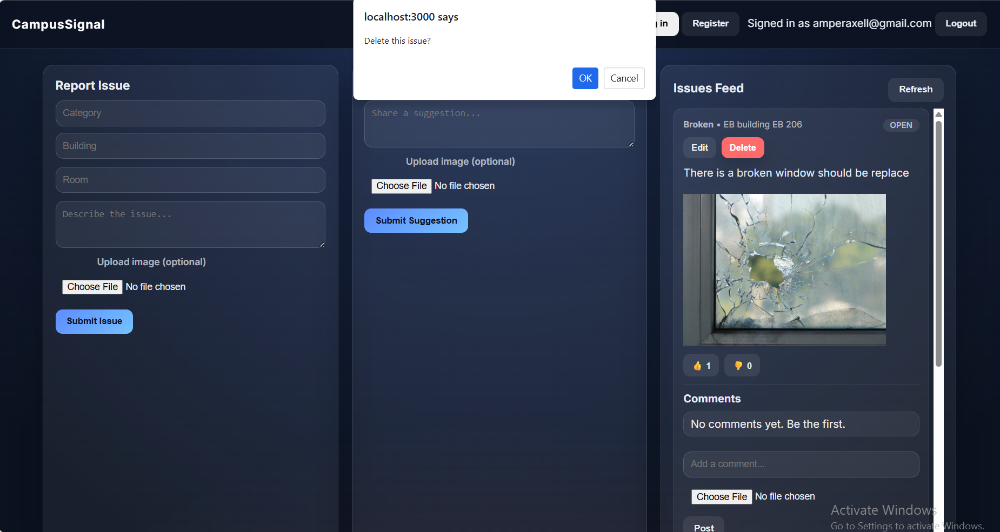
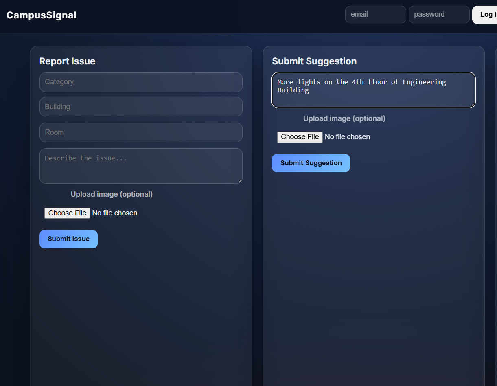
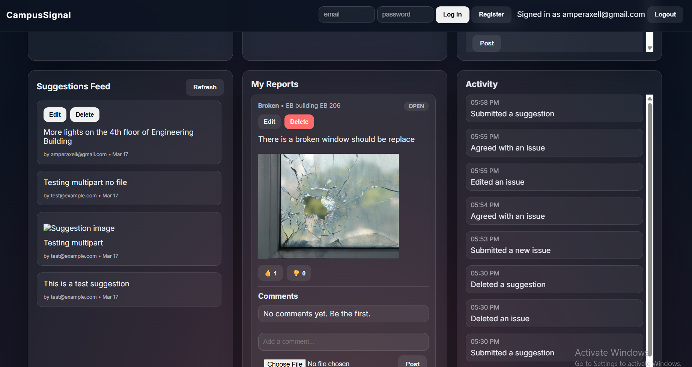

<<<<<<< HEAD
<p align="center">
  <a href="http://nestjs.com/" target="blank"></a>
</p>

[circleci-image]: https://img.shields.io/circleci/build/github/nestjs/nest/master?token=abc123def456
[circleci-url]: https://circleci.com/gh/nestjs/nest

  <p align="center">A progressive <a href="http://nodejs.org" target="_blank">Node.js</a> framework for building efficient and scalable server-side applications.</p>
    <p align="center">
<a href="https://www.npmjs.com/~nestjscore" target="_blank"></a>
<a href="https://www.npmjs.com/~nestjscore" target="_blank"></a>
<a href="https://www.npmjs.com/~nestjscore" target="_blank"></a>
<a href="https://circleci.com/gh/nestjs/nest" target="_blank"></a>
<a href="https://discord.gg/G7Qnnhy" target="_blank"></a>
<a href="https://opencollective.com/nest#backer" target="_blank"></a>
<a href="https://opencollective.com/nest#sponsor" target="_blank"></a>
  <a href="https://paypal.me/kamilmysliwiec" target="_blank"></a>
    <a href="https://opencollective.com/nest#sponsor"  target="_blank"></a>
  <a href="https://twitter.com/nestframework" target="_blank"></a>
</p>
  <!--[](https://opencollective.com/nest#backer)
  [](https://opencollective.com/nest#sponsor)-->

## Description

[Nest](https://github.com/nestjs/nest) framework TypeScript starter repository.

## Project setup

```bash
$ npm install
```

## Compile and run the project

```bash
# development
$ npm run start

# watch mode
$ npm run start:dev

# production mode
$ npm run start:prod
```

## Run tests

```bash
# unit tests
$ npm run test

# e2e tests
$ npm run test:e2e

# test coverage
$ npm run test:cov
```

## Deployment

When you're ready to deploy your NestJS application to production, there are some key steps you can take to ensure it runs as efficiently as possible. Check out the [deployment documentation](https://docs.nestjs.com/deployment) for more information.

If you are looking for a cloud-based platform to deploy your NestJS application, check out [Mau](https://mau.nestjs.com), our official platform for deploying NestJS applications on AWS. Mau makes deployment straightforward and fast, requiring just a few simple steps:

```bash
$ npm install -g @nestjs/mau
$ mau deploy
```

With Mau, you can deploy your application in just a few clicks, allowing you to focus on building features rather than managing infrastructure.

## Resources

Check out a few resources that may come in handy when working with NestJS:

- Visit the [NestJS Documentation](https://docs.nestjs.com) to learn more about the framework.
- For questions and support, please visit our [Discord channel](https://discord.gg/G7Qnnhy).
- To dive deeper and get more hands-on experience, check out our official video [courses](https://courses.nestjs.com/).
- Deploy your application to AWS with the help of [NestJS Mau](https://mau.nestjs.com) in just a few clicks.
- Visualize your application graph and interact with the NestJS application in real-time using [NestJS Devtools](https://devtools.nestjs.com).
- Need help with your project (part-time to full-time)? Check out our official [enterprise support](https://enterprise.nestjs.com).
- To stay in the loop and get updates, follow us on [X](https://x.com/nestframework) and [LinkedIn](https://linkedin.com/company/nestjs).
- Looking for a job, or have a job to offer? Check out our official [Jobs board](https://jobs.nestjs.com).

## Support

Nest is an MIT-licensed open source project. It can grow thanks to the sponsors and support by the amazing backers. If you'd like to join them, please [read more here](https://docs.nestjs.com/support).

## Stay in touch

- Author - [Kamil Myśliwiec](https://twitter.com/kammysliwiec)
- Website - [https://nestjs.com](https://nestjs.com/)
- Twitter - [@nestframework](https://twitter.com/nestframework)

## License

Nest is [MIT licensed](https://github.com/nestjs/nest/blob/master/LICENSE).
=======
# CampusSignal

CampusSignal is a campus issue reporting dashboard built with **NestJS (TypeScript)** backend, **MySQL (TypeORM)** database, and a **Vanilla HTML/CSS/JS** frontend served from the backend.

---

## Features (Selected)

### 1) Issue Reporting System
**Purpose:** Let students report campus issues (e.g., broken equipment, maintenance needs) with optional images.

**Expected User:** Logged-in student or campus staff.

**Main Functionality:**
- Submit a new issue with text and optional image upload.
- Store issue records in the database, linked to the user.
- Display a feed of reported issues on the dashboard.

**Acceptance Criteria:**
- Users can submit a report with a description and optional image.
- New reports appear immediately in the dashboard issue feed.
- Each report saves user ID, description, timestamp, and image URL when uploaded.

---

### 2) Suggestion & Comment System
**Purpose:** Allow users to add suggestions or comments on issues, optionally including an image.

**Expected User:** Logged-in campus community member.

**Main Functionality:**
- Post a suggestion/comment tied to an issue (or standalone).
- Allow optional image uploads with suggestions.
- Enable users to edit / delete their own suggestions.

**Acceptance Criteria:**
- Users can submit a suggestion with text and optional image.
- Suggestions show up under the related issue with user and timestamp.
- Users can only edit or delete suggestions they created.

---

## What Was Implemented

- **Backend (NestJS + MySQL):** Built REST APIs for issues, suggestions, votes, and authentication using NestJS controllers + services. Integrated TypeORM entities and relations (User, Issue, Suggestion, Vote).
- **Frontend (UI Dashboard):** Created a clean Bento-style dashboard UI with HTML/CSS/JS. Forms allow submitting issues and suggestions, and the UI updates dynamically.
- **Integration:** Implemented JWT authentication (login/register) with token storage, and wired frontend API calls to backend endpoints for CRUD operations. Added image upload handling with multipart/form-data.

---

## Problems / Challenges Encountered

- **Fixing suggestion submission bug:** The frontend was forcing `Content-Type: application/json` when uploading FormData, breaking image upload. Fixed by letting the browser set the multipart header.
- **Handling image upload:** Ensured uploads are saved under `public/uploads` and the backend returns a usable URL.
- **Connecting frontend to backend:** Needed consistent API paths and error handling for failed requests.
- **Managing JWT authentication:** Stored JWT in localStorage, sent it on protected requests, and guarded backend routes.
- **Debugging DB relations:** Used TypeORM relations/cascades and seeded required roles to avoid foreign key issues.

---

## Screenshots






>>>>>>> docs/specs
